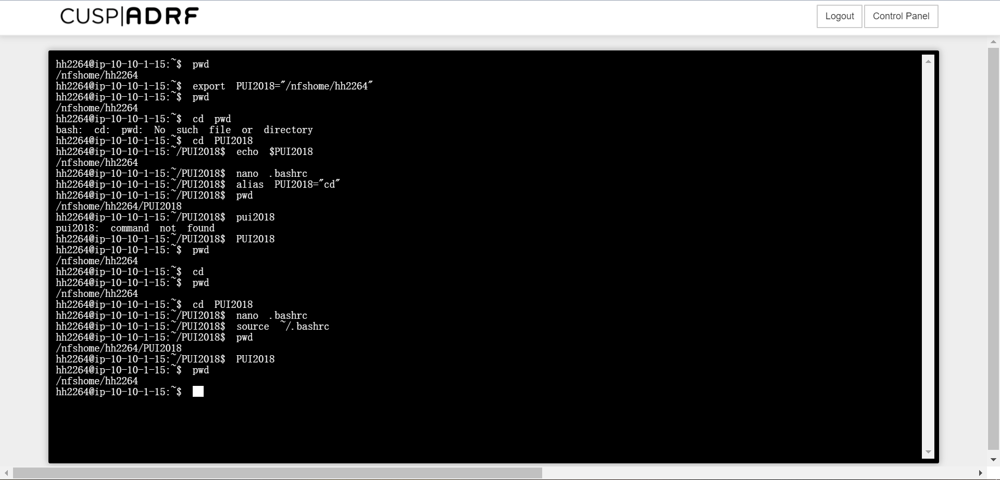

# HW1

To set up my environment on my terminal, I created a directory on my workspace on CUSP-ADRF called PUI2018.
Then I changed directory to the newly created PUI2018 and checked my present working directory to make sure it is in the right place.
After that I opened the nano file editor to make the PUI2018 environmental variable permanent. 
Then I created alias for shortcuts to commands, and took a screenshot of the current bashrc file.
Then I typed some commands to set my present working directory as PUI2018 and took a second screenshot of the terminal. 

