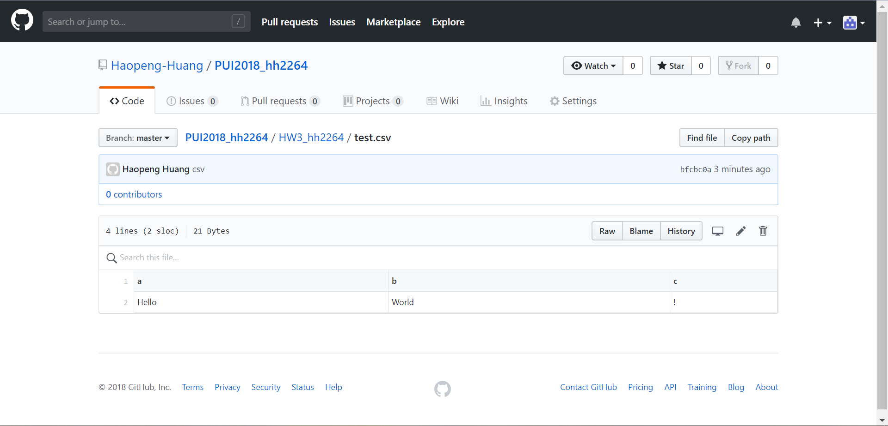
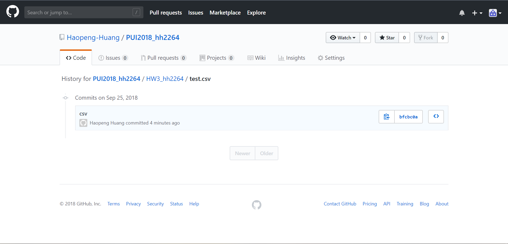
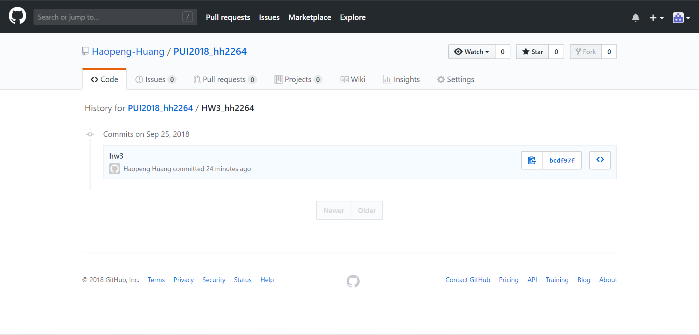
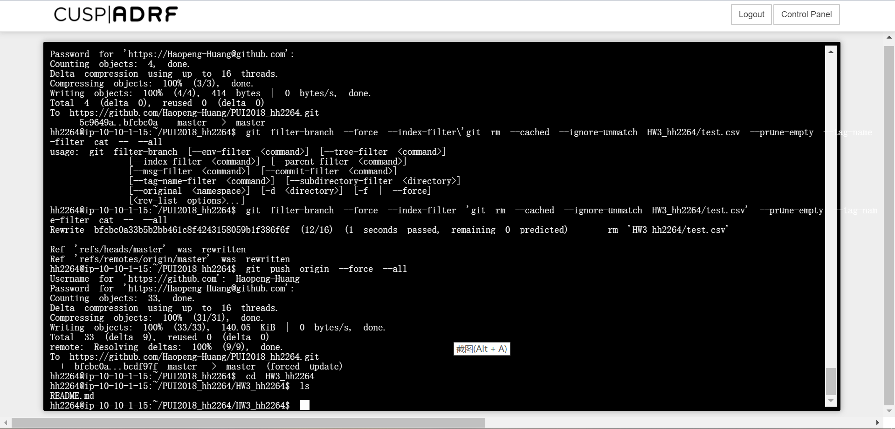

# HW3

For Assignment 1, I created a README.md file and a test.csv file with 2 lines of text in it locally as instructed. 
I commited these files to my repo and took screenshots of my repo and its history.

Then I typed the commands to remove the test.csv file and its history from the repo. I checked my local file and my repo history and saw no test.csv file and its history. 

For Assignment 2, I found a CSV dataset in Water Consumption in NYC over Time from NYC Open Data. Then I used pandas dataframe to take out two columns of quantitative data and make a plot. 

Next I used API with json file as a second solution to plot the two columns against the time column respectively. 

For Assignment 3, 
