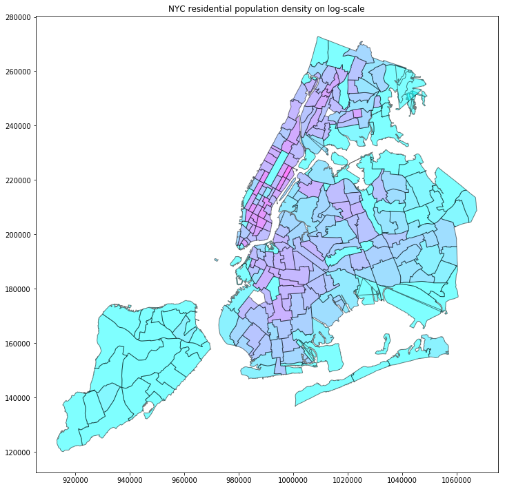

# PUI2018 Homework 8

### Assignment 1
Visualization of NYC Residential Population Density Map on log-scale using data for residential location and demographic decomposition of urban population acording to LEHD and data for work location and demographic decomposition of urban population acording to LEHD. The other data files in this repo folder are just in case that the reviewer cannot access data from PUIdata and view the plot.

Fig.1 NYC Residential Population Density Map on log-scale.

Red/purple-ish color is for higher residential population density in the taxi zone. Uptown east, midtown, and downtown Manhattan have the highest residential population density. So do some taxi zones in Bronx, Queens, and Brooklyn that are closer geographically to Manhattan.

------------------------------------------------------------------------------------------------------------------------------------------

### Assignment 2
Authorea article link: https://www.authorea.com/users/249936/articles/336628-do-women-spend-less-time-biking-per-citibike-trip-than-men-do

I got help from Pengzi Li of which test to use and how to use it. 
